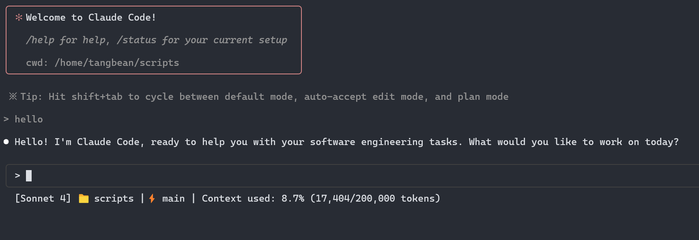

# How to use `claude-code-status-line.py` in `/statusline`

NOTE: claude code version >= 1.0.72

1. Download `claude-code-status-line.py` to certain folder, for example: `/path/to/claude-code-status-line.py`
2. Add execution permission to it: `chmod +x /path/to/claude-code-status-line.py`
3. Update `~/.claude/setting.json`:

```
{
    "env": {...},
    "hooks": {...}
    // Your previous settings ...
    "statusLine": {
        "type": "command",
        "command": "/path/to/claude-code-status-line.py"
    }
}
```

Then enter claude code, you will get a status line like this:

`[Model Name] 📁 <current folder name> |⚡️ <git branch name> | Context used: ??.?% (??,???/200,000 tokens)`


